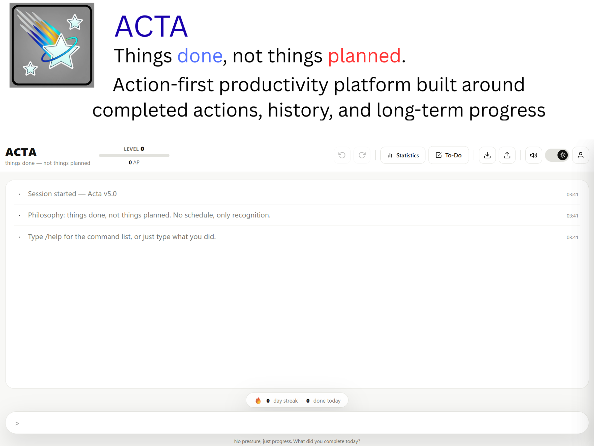
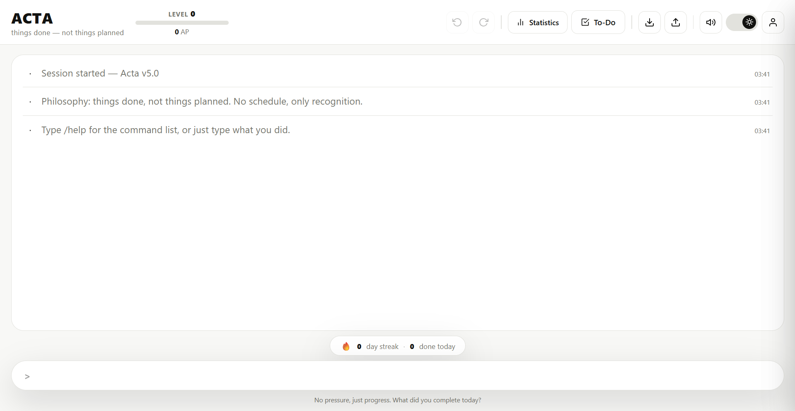
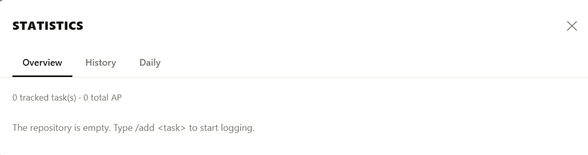
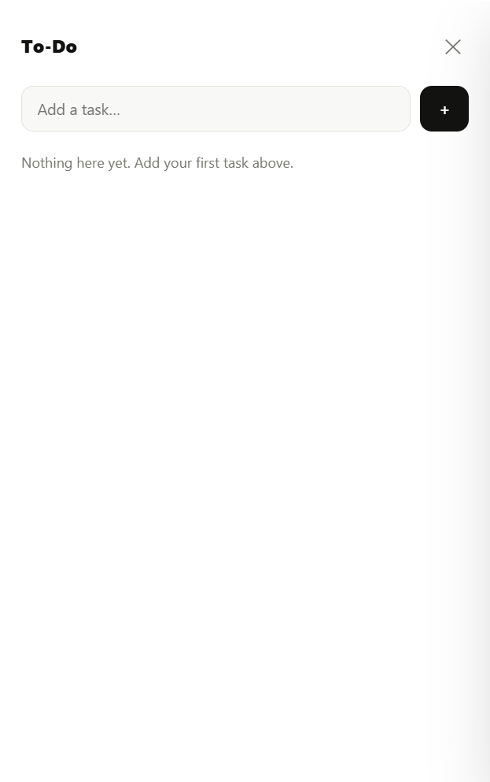
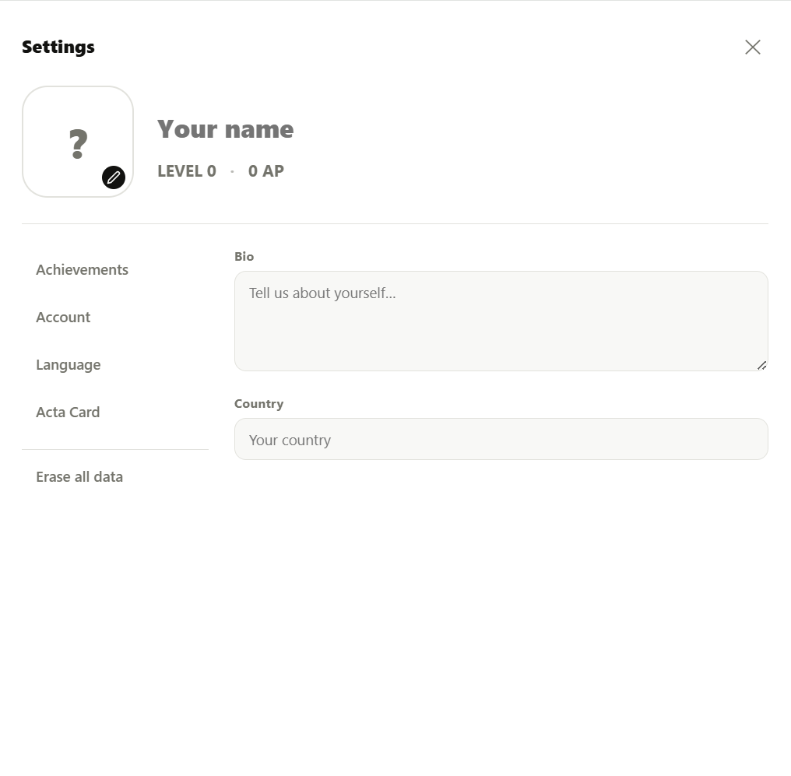

# ACTA

> Things done, not things planned.

ACTA is a free and open-source productivity application built around a simple idea:

**Recognize actions instead of rewarding plans.**

Unlike traditional productivity tools that begin with schedules, deadlines, and predefined task lists, ACTA starts from what has already been accomplished. Every completed action becomes part of a growing personal history rather than another unfinished obligation.

Originally developed as a personal experiment, the project evolved through multiple independent versions, beginning as a Godot prototype before being rewritten as a browser-based application using HTML, CSS, and JavaScript.

Today, ACTA represents more than a productivity application. It documents an entire product-development journey—from identifying a problem to iteratively refining a solution through experimentation, reflection, and continuous learning.

---



---

# Quick Links

- Vision → `docs/vision.md`
- Non-Goals → `docs/non-goals.md`
- Known Limitations → `docs/known-limitations.md`
- Lessons Learned → `docs/lessons-learned.md`
- Legacy Versions → `legacy/README.md`

---

# Why ACTA?

Most productivity applications begin with planning.

You create tasks.

You organize them.

You schedule them.

Then reality happens.

Plans change. Priorities shift. Unexpected responsibilities appear. Carefully organized schedules become outdated.

ACTA was created around a different question:

> What if productivity started from completed actions instead of planned intentions?

Instead of asking:

> What are you going to do?

ACTA asks:

> What did you actually accomplish?

This small shift changes the entire experience.

Rather than rewarding perfect planning, ACTA focuses on recognizing consistent action, reducing friction, and preserving meaningful progress.

---

# Features

## Action-First Workflow

ACTA records completed actions rather than focusing exclusively on future plans.

Every action contributes to a meaningful personal history.

## AP (Acta Point) System

ACTA recognizes execution through AP (Acta Point).

Small actions accumulate into measurable long-term progress.

## Statistics

ACTA provides multiple ways to understand personal activity:

- Daily summaries
- Complete history
- Search and filtering
- Monthly activity charts
- Historical records
- Trend exploration

## Integrated To-Do List

Tasks and completed actions remain connected while minimizing duplicate workflows.

## User Profiles

Profile customization includes:

- Avatar
- Name
- Biography
- Country
- Language
- Personal statistics

## Cloud Synchronization

Progress can be synchronized across devices through cloud storage while still supporting local usage.

## Import & Export

Users can preserve their own data through:

- JSON Import
- JSON Export
- PDF Export
- Historical Reports

## ACTA Card

ACTA Card summarizes long-term progress through a compact visual identity containing:

- Level
- AP
- Streak
- Statistics
- Profile information

## Keyboard-First Interaction

Many actions can be performed directly from the keyboard to reduce interaction friction.

## Responsive Design

ACTA is designed to work across desktop and mobile devices.

---

# Screenshots

## Main Workspace



## Statistics



## To-Do List



## Settings



# Demo

The repository preserves both the current implementation and historical versions of the project.

## Godot Prototype

A demonstration video of the original Godot prototype is included:

```text
legacy/godot/demo.mp4
```

## Historical Versions

All major releases are preserved inside:

```text
legacy/
```

allowing visitors to explore the project's evolution from prototype to current version.

---

# The Story

ACTA did not begin as a software project.

It began as a personal problem.

Many productivity systems focus heavily on planning, schedules, and future intentions.

Real life rarely follows a fixed schedule.

Plans change.

Priorities shift.

Unexpected opportunities appear.

Yet meaningful progress still happens.

That observation became the foundation of ACTA.

The earliest versions were built inside Godot as experimental prototypes. Over time, the underlying ideas proved more important than the technology itself.

Those ideas eventually evolved into a browser-based application focused on recognizing actions rather than unfinished intentions.

Every major version explored the same question:

> How can software make meaningful progress easier to recognize?

The complete journey is preserved throughout this repository.

---

# Philosophy

Several principles have remained consistent throughout every version.

## Recognize Actions, Not Intentions

Progress should be measured by what actually happened.

## Reduce Friction

Recording progress should never become more difficult than making progress itself.

## Simplicity Is a Feature

More features do not automatically create a better product.

## Software Should Adapt To People

Productivity tools should reflect real human behavior rather than ideal schedules.

## Continuous Improvement

Every version represents another step toward a clearer and simpler experience.

---

# Technology

ACTA intentionally relies on a lightweight technology stack.

## Frontend

- HTML5
- CSS3
- Vanilla JavaScript

## Storage

- Local Storage
- Firebase Firestore

## Authentication

- Firebase Authentication

## Development

- Git
- GitHub

No frontend framework is required.

---

# Architecture

```text
User
    │
    ▼
Interface
    │
    ▼
Interaction Layer
    │
    ▼
Application Logic
    │
    ▼
Data Management
    │
 ┌──┴─────────────┐
 │                │
 ▼                ▼
Local Storage   Cloud Storage
```

The architecture prioritizes simplicity, maintainability, and clarity over unnecessary abstraction.

---

# Project Structure

```text
ACTA
│
├── assets/
├── docs/
├── legacy/
├── src/
│
├── LICENSE
├── README.md
└── .gitignore
```

## assets/

Project media resources.

- Hero banner
- Screenshots
- Logos
- Demo materials

## docs/

Project philosophy, vision, limitations, and development reflections.

## legacy/

Historical versions preserved for documentation purposes.

## src/

Current implementation of ACTA.

---

# Getting Started

## Clone The Repository

```bash
git clone https://github.com/hieutran070509-wq/Acta.git
```

## Run Locally

Open the latest version inside a modern web browser.

No build process is required.

---

# Documentation

Additional documentation is available inside the `docs/` directory.

| Document | Description |
|-----------|-------------|
| vision.md | Long-term direction |
| non-goals.md | Product boundaries |
| lessons-learned.md | Development reflections |
| known-limitations.md | Constraints and trade-offs |

---

# Legacy Versions

ACTA evolved through multiple independent releases.

The repository preserves:

- Godot Prototype v0.2
- Godot Prototype v0.5
- Web v1.0
- Web v2.0
- Web v3.0
- Web v3.5
- Web v4.0
- Web v4.5
- Web v5.0

These versions exist to document evolution rather than perfection.

---

# AI-Assisted Development

ACTA was developed with AI as a collaborative development tool throughout much of its lifecycle.

AI assisted with:

- Research
- Brainstorming
- Documentation
- Debugging
- Interface exploration
- Refactoring ideas
- Technical learning

However, the project's philosophy, architecture, long-term vision, feature prioritization, and final implementation decisions remained human-directed.

ACTA should therefore be viewed as an example of AI-assisted product development, where artificial intelligence accelerated experimentation and learning without replacing human reasoning, creativity, or decision-making.

---

# Lessons Learned

Building ACTA fundamentally changed the way software development is approached.

One of the most important lessons was that removing complexity often creates more value than adding features.

The project evolved through experimentation, iteration, refinement, and reflection.

Additional insights are documented in:

```text
docs/lessons-learned.md
```

---

# Known Limitations

ACTA remains an actively evolving project.

Some limitations are intentional trade-offs, while others reflect current resources, scope, and technology constraints.

These limitations are documented openly rather than hidden.

See:

```text
docs/known-limitations.md
```

---

# Roadmap

Potential future improvements include:

- Accessibility improvements
- Mobile refinements
- Performance optimization
- Expanded statistics
- Additional language support
- Better synchronization
- UI improvements
- Progressive Web App enhancements

The roadmap remains flexible and guided by project philosophy rather than feature count.

---

# Contributing

Contributions are welcome.

You can help by:

- Reporting bugs
- Suggesting improvements
- Improving documentation
- Submitting Pull Requests
- Participating in discussions

When contributing, please keep proposals aligned with ACTA's philosophy of reducing friction, recognizing actions, and preserving simplicity.

---

# License

This project is distributed under the MIT License.

You are free to use, modify, distribute, and build upon the source code under the terms of the license.

See the LICENSE file for complete details.

---

# Acknowledgements

Special thanks to:

- The open-source community
- The Godot community
- Firebase
- GitHub
- AI-assisted development tools
- Everyone who contributed feedback, suggestions, or support

ACTA exists because meaningful progress deserves to be recognized.

> One action at a time.
